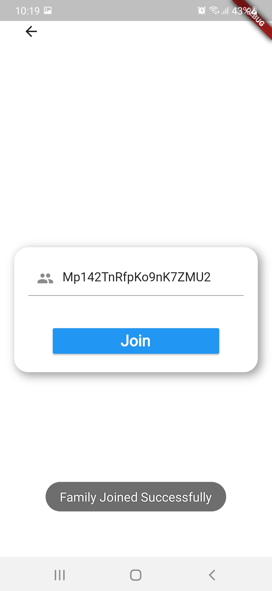

# FamilyApp

This was my **Junior Design** course project.

### Homepage:

## Main Features

### Family Location:

User can see the last location of their family members, along with the last online status.

### Create Family Group:

User can create a family group so that family members can be connected to one another.

### Join Family Group:

User can join a family group.

I am planning on polishing this project in the near future and hopefully people will find it useful.
If you are inspired by this project, do please acknowledge this repository :innocent: :v:
